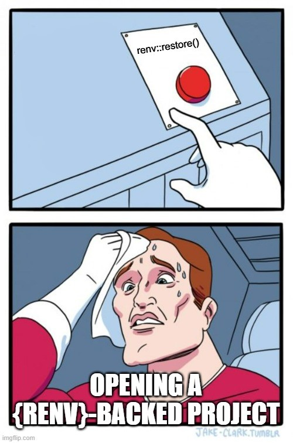
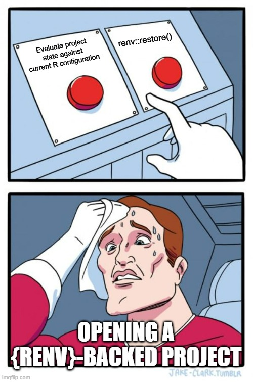

# Picking up {renv}-backed project

## Users might think they have one choice



## But they actually have an alternative



# Timeline

* Preceded by {packrat}

  + Sep 2014 {packrat} 0.4.1 released to CRAN
  
  + Sep 2023 {packrat} 0.9.2 released (last release)
  
  + {packrat} has been soft-deprecated and is now superseded by {renv}.

* Oct 2019, v0.8.0 first released to CRAN 

* Jul 2022, E. David Aja at posit::conf [You should use renv](https://www.youtube.com/watch?v=GwVx_pf2uz4)

* Jul 2023, v1.0.0 released <https://github.com/rstudio/renv/releases/tag/v1.0.0>

  + May 2023 lots of documentation updates <https://github.com/rstudio/renv/pull/1236>
  


#  What does {renv} DO and NOT DO


<https://rstudio.github.io/renv/articles/renv.html#caveats>


People wish {renv} solved problems two layers up in the onion.
It doesn't. <https://rstats.wtf/personal-radmin#the-project-onion-r>

# We'll probably need to talk about...

## Personal R administration

* [R-Ladies workshop recording](https://www.youtube.com/watch?v=YNTozV6kxSE); [slides](https://rstats-wtf.github.io/wtf-personal-radmin-slides/#/title-slide)

## Libraries

```
.libPaths()
installed.packages() |> as.data.frame() |> View()
```

## CRAN promises

> The aim is to have CRAN work "at any point in time" 

~ Dirk Eddelbuettel on R Contributors slack, Feb 2025

## Repositories

* https://rstudio.github.io/renv/articles/renv.html?q=reposit#libraries-and-repositories

* https://rstudio.github.io/renv/articles/package-sources.html

* https://posit.co/blog/migrating-from-mran-to-posit-package-manager/

* https://posit.co/blog/announcing-public-package-manager/

* MRAN	1/1/2014 - 7/1/2023		

* CRAN	1/1/1997	- today	

* Bioconductor	5/1/2002	- today

* Posit Public Package Manager	6/23/2020	- today

* R-Universe	3/21/2021		- today

## Binaries

* https://r-pkgs.org/structure.html

* https://r-pkgs.org/structure.html#fig-package-files

* https://rstats.wtf/installing-packages

## Global cache

* https://rstudio.github.io/renv/articles/package-install.html#cache

* Note: The location of the global cache has changed with different versions 
of {renv}. This can lead to confusing results/messaging if you are 
switching between {renv} versions (e.g., seeing that a package is not
installed but you thought it was.)


# Decisions

https://rstudio.github.io/renv/articles/faq.html#im-returning-to-an-older-renv-project--what-do-i-do

1. Treat project as  time capsule with dependencies frozen in time.

* `renv::restore()`

2. Treat project as fluid; update all packages.

* `renv::update()`; confirm everything works; `renv::snapshot()`

  + _Note:_ `renv::update()` updates packages that already exist in your project library.
  If your project library has not been populated, then do `renv::install()` to install
  the latest versions of all packages recorded in the lockfile.

3. Something in between

* `renv::restore()`; `renv::install()` specific packages; `renv::snapshot()`

# First notes

1. What version of {renv} is the project on?

2. What package repository is the project configured to use?

3. How does your system version of R align with what is recorded in the `renv.lock`?


# Example project

<https://github.com/edavidaja/todo-backend-plumber>


1. Clone repo

`usethis::create_from_github("https://github.com/edavidaja/todo-backend-plumber")`

```
# Bootstrapping renv 0.14.0 --------------------------------------------------
* Downloading renv 0.14.0 ... OK
* Installing renv 0.14.0 ... Done!
* Successfully installed and loaded renv 0.14.0.
* Project 'C:/Users/pileggis/Documents/gh-personal/todo-backend-plumber' loaded. [renv 0.14.0]
Warning message:
Project requested R version '4.1.1' but '4.4.2' is currently being used 
* The project library is out of sync with the lockfile.
* Use `renv::restore()` to install packages recorded in the lockfile.
```
In `renv.lock`

```
"R": {
    "Version": "4.1.1",
    "Repositories": [
      {
        "Name": "CRAN",
        "URL": "https://cran.rstudio.com"
      }
    ]
  },
  ...
  "renv": {
      "Package": "renv",
      "Version": "0.14.0",
      "Source": "Repository",
      "Repository": "CRAN",
      "Hash": "30e5eba91b67f7f4d75d31de14bbfbdc"
    }
  ...
```

## Assess R version

* Decide: frozen or updated project?

* Use `rig` to manage R version <https://github.com/r-lib/rig>

```
rig
rig list
rig default 4.1.1
rig default 4.4.2
```

* Live in the happy place, where you align your system R version with what you aim to have in the lockfile.

* Otherwise, ☠️ there be dragons ☠️.

## Upgrade {renv} to most recent version

* For versions of {renv} >= 1.0.1, try `renv::upgrade()`.

  + `renv::upgrade()` updates the version of `renv` used for this project
  
  + has an additional benefit of simultaneously updating `renv.lock`

* Older versions of `renv` do not successfully implement `renv::upgrade()`.
If `renv::upgrade()` fails, try

  + Use `renv::deactivate()` to temporarily de-activate {renv}.
  
  + Use `install.packages("renv")` to install the latest version of {renv}.
  
  + Use `renv::activate()` to re-activate your project with the newest version of {renv}.
  
  + Use `renv::record("renv")` (or similar) to update {renv} in the lockfile.
  
```
renv::deactivate()
install.packages("renv")
renv::activate()
renv::record("renv@1.1.1")
```

  
## Update packages & change the package repository

* <https://rstudio.github.io/renv/articles/renv.html#updating-packages>

* Especially helpful to change repository for "frozen" projects to install package binaries (rather than packages from source)

* https://www.pipinghotdata.com/posts/2024-09-16-ease-renvrestore-by-updating-your-repositories-to-p3m/

* https://packagemanager.posit.co/client/#/

  + Use `SETUP` interface

_Work in progress, may not be 100% correct_

* Install versions specified in lockfile, from lockfile specified repository

  + `renv::restore()`

* Install versions specified in lockfile, but specify repository

  + `renv::restore(repos = c(CRAN = "https://p3m.dev/cran/latest"))`

* Install versions available on CRAN at specified date (respects repo from lockfile unless otherwise specified)

  + `renv::restore(repos = c(CRAN = "https://packagemanager.posit.co/cran/2021-11-01"))`
  
  + `renv::checkout(date = "2023-08-01")`

* Install latest available package versions

  + `renv::update()` (default works on packages already installed in your project library, from CRAN or GitHub only)
 
  + `renv::install()` (default works on all packages specified in lockfile)


* `renv::checkout()` works with Posit Package Manager to install latest available
packages from a specified date

  + `renv::checkout(date = "2023-08-01")`

  + recommended for use after 2023-07-07 (v1.0.0 of {renv}, 
  when the checkout function was released)
  
  + note this will also take back the version of {renv} to that date as well

# Implicit vs explicit dependencies

* Default mode is implicit

  + `renv::dependencies()` parsed all `.R`, `.Rmd`, `.qmd` and `DESCRIPTION` files for packages used

  + can lead to slow project start up or restart up if many files to scan

* Can change to explicit 

  + <https://rstudio.github.io/renv/articles/faq.html?q=explicit#capturing-explicit-dependencies>

  + `renv::settings$snapshot.type("explicit")`

  + Only considers dependencies captured in `DESCRIPTION` file (no file parsing)


# Side note

You can read information from the lock file

```
lockfile <- renv::lockfile_read("renv.lock")
names(lockfile$Packages)
```

# Various botched things

## Example botched restore attempt

R in `renv.lock` is 4.1.1, R on system is 4.4.2. Attempt restoration of 
previous package versions (no repo specification).


`renv::restore()`

```
Successfully downloaded 19 packages in 25 seconds.

# Installing packages --------------------------------------------------------
- Installing DBI ...                            OK [built from source and cached in 4.6s]
- Installing R6 ...                             OK [linked from cache]
- Installing Rcpp ...                           OK [built from source and cached in 29s]
- Installing crayon ...                         OK [built from source and cached in 2.6s]
- Installing curl ...                           OK [built from source and cached in 35s]
- Installing rlang ...                          OK [built from source and cached in 13s]
- Installing ellipsis ...                       OK [linked from cache]
- Installing glue ...                           OK [built from source and cached in 4.3s]
- Installing later ...                          OK [built from source and cached in 22s]
- Installing magrittr ...                       OK [built from source and cached in 3.9s]
- Installing promises ...                       OK [built from source and cached in 12s]
- Installing httpuv ...                         FAILED
Error: Error installing package 'httpuv':
==================================

* installing *source* package 'httpuv' ...
** package 'httpuv' successfully unpacked and MD5 sums checked
** using staged installation
** libs
using C compiler: 'gcc.exe (GCC) 13.2.0'
using C++ compiler: 'G__~1.EXE (GCC) 13.2.0'
using C++11
...
```

Issues:

* We successfully built 9 packages from source, 2 were linked from cache.

* Then we hit an installation error for `httpuv`due to requirements for compiling from source.

## Example botched package update attempt

```
> renv::update()
- Querying repositories for available binary packages ... Done!
- Querying repositories for available source packages ... Done!
- Checking for updated packages ... Done!
The following package(s) will be updated:

# CRAN -----------------------------------------------------------------------
- class        [7.3-22 -> 7.3-23]
- cluster      [2.1.6 -> 2.1.8]
- foreign      [0.8-87 -> 0.8-88]
- KernSmooth   [2.23-24 -> 2.23-26]
- MASS         [7.3-61 -> 7.3-64]
- Matrix       [1.7-1 -> 1.7-2]
- nlme         [3.1-166 -> 3.1-167]
- nnet         [7.3-19 -> 7.3-20]
- rpart        [4.1.23 -> 4.1.24]
- spatial      [7.3-17 -> 7.3-18]
- survival     [3.7-0 -> 3.8-3]
...
Successfully installed 11 packages in 0.23 seconds.

installed.packages() |> as.data.frame() |> View()
```

Only updated base or recommended packages...
because {renv} only updates packages that are already installed.

## Example botched checkout

This was on a different repo with a single .R file containing

```
x <- "red"

glue::glue("roses are {x}")
```

Attempted to checkout, but older version of installed package does 
not exist likely because location of cache changed.

```
> x <- "red"
> glue::glue("roses are {x}")
roses are red
> renv::init()
- Linking packages into the project library ... Done!
The following package(s) will be updated in the lockfile:

# CRAN -----------------------------------------------------------------
- renv   [* -> 1.1.1]

# P3M ------------------------------------------------------------------
- glue   [* -> 1.8.0]

The version of R recorded in the lockfile will be updated:
- R      [* -> 4.4.2]

- Lockfile written to "C:/Users/pileggis/Documents/gh-personal/example-glue/renv.lock".

Restarting R session...

- Project 'C:/Users/pileggis/Documents/gh-personal/example-glue' loaded. [renv 1.1.1]
> renv::checkout(date = "2022-01-01")
- Querying repositories for available source packages ... Done!
The following package(s) will be updated:

# Repository -----------------------------------------------------------
- glue   [repo: https://p3m.dev/cran/latest -> *; ver: 1.8.0 -> 1.6.0]
- renv   [repo: CRAN -> *; ver: 1.1.1 -> 0.14.0]

Do you want to proceed? [Y/n]: Y

# Downloading packages -------------------------------------------------
- Querying repositories for available binary packages ... Done!
- Downloading glue from Repository ...          OK [161.4 Kb in 0.9s]
- Downloading renv from Repository ...          OK [1.2 Mb in 1.9s]
Successfully downloaded 2 packages in 5 seconds.

# Installing packages --------------------------------------------------
- Installing glue ...                           OK [installed binary and cached in 0.33s]
- Installing renv ...                           OK [installed binary and cached in 0.52s]

The following loaded package(s) have been updated:
- renv
Restart your R session to use the new versions.


Restarting R session...

* Project 'C:/Users/pileggis/Documents/gh-personal/example-glue' loaded. [renv 0.14.0]
Warning message:
renv 0.14.0 was loaded from project library, but this project is configured to use renv ${VERSION}.
Use `renv::record("renv@0.14.0")` to record renv 0.14.0 in the lockfile.
Use `renv::restore(packages = "renv")` to install renv ${VERSION} into the project library. 
* The project library is out of sync with the lockfile.
* Use `renv::restore()` to install packages recorded in the lockfile.
> renv::snapshot()
The following package(s) will be updated in the lockfile:

# P3M ================================
- glue   [1.8.0 -> *]

Do you want to proceed? [y/N]: N
* Operation canceled.
> packageVersion("glue")
Error in packageVersion("glue") : there is no package called 'glue'
```


